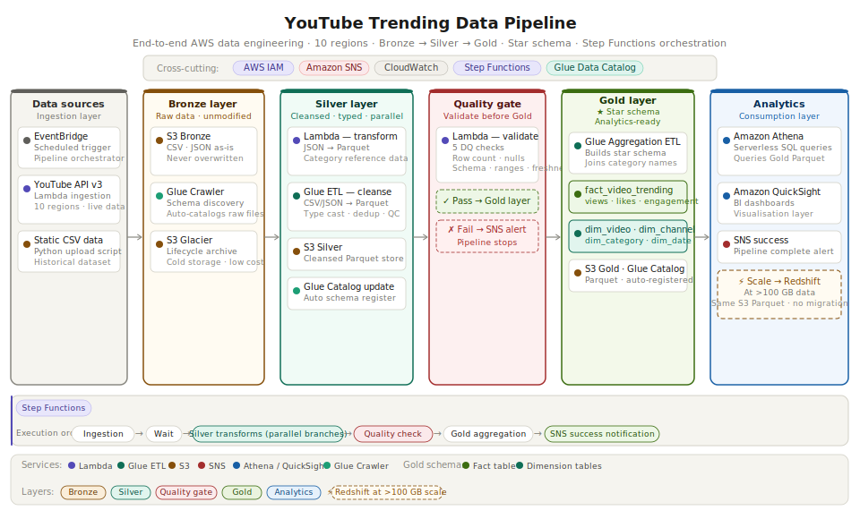

## Architecture


# YouTube Trending Data Pipeline

> End-to-end AWS data engineering pipeline that ingests, transforms, and analyses YouTube trending video data across 10 regions using a Bronze → Silver → Gold medallion architecture.

---

## Overview

This project implements a production-grade data pipeline on AWS that:

- Ingests YouTube trending data via the **YouTube Data API v3** and historical **static CSV datasets**
- Processes data through a **three-layer medallion architecture** (Bronze → Silver → Gold)
- Enforces **data quality gates** before promoting data to the analytics layer
- Produces a **star schema** optimised for BI querying
- Orchestrates the entire workflow with **AWS Step Functions**
- Visualises insights through **Amazon QuickSight** dashboards

---

## Architecture

> See diagram above — generated from the pipeline design.

### Pipeline layers

| Layer | Purpose | Key services |
|-------|---------|-------------|
| **Bronze** | Raw data as-is, never modified | S3, Glue Crawler, S3 Glacier |
| **Silver** | Cleansed, typed, deduplicated Parquet | Lambda, Glue ETL, S3, Glue Catalog |
| **Quality gate** | Validates Silver before Gold promotion | Lambda, SNS |
| **Gold** | Star schema, analytics-ready aggregations | Glue ETL, S3, Glue Catalog |
| **Analytics** | Serverless SQL queries and dashboards | Athena, QuickSight |

### Cross-cutting services

- **AWS IAM** — fine-grained roles and policies per service
- **Amazon SNS** — failure alerts and pipeline success notifications
- **Amazon CloudWatch** — logging and monitoring across all Lambda and Glue jobs
- **AWS Step Functions** — full pipeline orchestration with parallel branches and decision states

---

## Data sources

| Source | Format | Description |
|--------|--------|-------------|
| YouTube Data API v3 | JSON | Live trending videos fetched per region via scheduled Lambda |
| Static CSV dataset | CSV | Historical trending data uploaded via Python script |

**Regions covered:** CA · US · GB · DE · FR · IN · JP · KR · MX · RU

---

## Pipeline steps

```
EventBridge (scheduled trigger)
        │
        ▼
1. Ingestion
   ├── Lambda fetches YouTube API → Bronze S3 (JSON)
   └── Python script uploads static CSV → Bronze S3
        │
        ▼
2. Wait state
   Ensures all files have landed in Bronze S3
        │
        ▼
3. Silver transforms (parallel branches)
   ├── Lambda: category JSON → flattened Parquet → Silver S3
   └── Glue ETL: CSV/JSON → typed, deduplicated Parquet → Silver S3
             └── Glue Crawler updates Silver catalog
        │
        ▼
4. Data quality gate (Lambda)
   Checks: row count · null % · schema · value ranges · freshness
   ├── PASS → continue to Gold
   └── FAIL → SNS failure alert · pipeline stops
        │
        ▼
5. Gold aggregation (Glue ETL)
   Builds star schema from Silver data
        │
        ▼
6. SNS success notification
        │
        ▼
7. Athena queries · QuickSight dashboards
```

---

## Gold layer — star schema

The Gold layer is modelled as a **star schema** for optimised analytics query performance.

```
                    ┌──────────────┐
                    │  dim_date    │
                    │  date_id PK  │
                    │  year        │
                    │  month       │
                    │  day         │
                    │  day_of_week │
                    └──────┬───────┘
                           │
┌──────────────┐    ┌──────▼───────────────┐    ┌──────────────────┐
│  dim_video   │    │  fact_video_trending  │    │  dim_category    │
│  video_id PK │◄───│  video_id FK          │───►│  category_id PK  │
│  title       │    │  category_id FK       │    │  category_name   │
│  publish_time│    │  date_id FK           │    │  assignable      │
│  tags        │    │  channel_id FK        │    └──────────────────┘
│  thumbnail   │    │  views                │
└──────────────┘    │  likes                │    ┌──────────────────┐
                    │  dislikes             │    │  dim_channel     │
                    │  comment_count        │◄───│  channel_id PK   │
                    │  engagement_rate      │    │  channel_title   │
                    │  like_dislike_ratio   │    │  primary_category│
                    └───────────────────────┘    │  total_views     │
                                                 └──────────────────┘
```

**Why star schema:**
- Faster Athena queries — join only the dimensions you need
- Less data scanned per query — lower cost
- Standard pattern understood by all BI tools
- Direct compatibility with QuickSight and Redshift

---

## Data quality checks

The quality gate Lambda validates Silver data on **5 dimensions** before promoting to Gold:

| Check | Description | Threshold |
|-------|-------------|-----------|
| Row count | Enough data exists | ≥ 10 rows |
| Null percentage | Critical columns populated | ≤ 5% nulls |
| Schema validation | Expected columns present | 0 missing columns |
| Value ranges | Numeric values are reasonable | Views ≤ 500M, no negatives |
| Freshness | Data is recent enough | Processed within 48 hours |

If any check fails the pipeline stops and an SNS alert is sent with the failure details.

---

## Scale path

> Current setup is optimised for datasets up to ~100 GB.

| Data size | Query engine | Notes |
|-----------|-------------|-------|
| < 100 GB | **Amazon Athena** | Serverless, pay-per-query, no idle cost |
| > 100 GB | **Amazon Redshift Spectrum** | Reads same S3 Parquet files — zero migration |
| > 1 TB | **Redshift + distribution keys** | Full warehouse with optimised distribution |

**No data migration needed when scaling** — Redshift Spectrum reads directly from the Gold S3 bucket, the same Parquet files Athena already queries.

---

## Project structure

```
youtube-data-pipeline/
├── data/
│   ├── CAvideos.csv
│   ├── CA_category_id.json
│   └── ... (10 regions)
├── data_quality/
│   └── dq_lambda.py
├── glue_jobs/
│   ├── bronze_to_silver_statistics.py
│   └── silver_to_gold_analytics.py
├── lambdas/
│   ├── json_to_parquet/
│   │   └── lambda_function.py
│   └── youtube_api_ingestion/
│       └── lambda_function.py
├── scripts/
│   ├── aws_copy.sh
│   └── information.md
└── README.md
```

---

## AWS services used

| Service | Purpose |
|---------|---------|
| Amazon S3 | Storage for Bronze, Silver, Gold, and Scripts buckets |
| AWS Lambda | JSON transformation, API ingestion, data quality checks |
| AWS Glue ETL | Large-scale data cleansing and Gold aggregation |
| AWS Glue Crawler | Automatic schema discovery and catalog updates |
| AWS Glue Data Catalog | Metadata store for all three layers |
| Amazon Athena | Serverless SQL queries on Gold Parquet |
| Amazon QuickSight | Business intelligence dashboards |
| AWS Step Functions | Pipeline orchestration and parallel execution |
| Amazon EventBridge | Scheduled pipeline triggers |
| Amazon SNS | Success and failure notifications |
| Amazon CloudWatch | Logging and monitoring |
| AWS IAM | Roles and least-privilege policies |
| Amazon S3 Glacier | Cost-optimised archiving of Bronze raw data |

---

## IAM design

Each service has its own **least-privilege IAM role**:

- **Lambda role** — S3 read/write (Bronze + Silver), SNS publish, CloudWatch logs, Glue catalog read/write
- **Glue role** — S3 read/write (all buckets), Glue catalog full access, CloudWatch logs
- **Step Functions role** — Lambda invoke, Glue job start/monitor, SNS publish, S3 list, CloudWatch logs

---

## Getting started

### Prerequisites

- AWS account with appropriate permissions
- Python 3.12+
- AWS CLI configured
- YouTube Data API v3 key ([Google Cloud Console](https://console.cloud.google.com))

### 1. Upload static data to Bronze

```bash
bash scripts/aws_copy.sh
```

### 2. Set Lambda environment variables

**JSON to Parquet Lambda:**

| Key | Value |
|-----|-------|
| `BUCKET_SILVER` | `your-silver-bucket` |
| `GLUE_DB_SILVER` | `your-silver-database` |
| `SNS_ALERT_TOPIC_ARN` | `your-sns-topic-arn` |

**API Ingestion Lambda:**

| Key | Value |
|-----|-------|
| `YOUTUBE_API_KEY` | `your-youtube-api-key` |
| `BRONZE_BUCKET` | `your-bronze-bucket` |
| `SNS_ALERT_TOPIC_ARN` | `your-sns-topic-arn` |
| `YOUTUBE_REGIONS` | `CA,US,GB,DE,FR,IN,JP,KR,MX,RU` |

### 3. Configure Glue job parameters

**Bronze → Silver:**

| Parameter | Value |
|-----------|-------|
| `--bronze_path` | `s3://your-bronze-bucket/youtube/raw_statistics/` |
| `--silver_database` | `your-silver-database` |
| `--silver_table` | `clean_statistics` |
| `--silver_path` | `s3://your-silver-bucket/youtube/clean_statistics/` |

**Silver → Gold:**

| Parameter | Value |
|-----------|-------|
| `--silver_database` | `your-silver-database` |
| `--silver_bucket` | `your-silver-bucket` |
| `--gold_bucket` | `your-gold-bucket` |
| `--gold_database` | `your-gold-database` |

### 4. Deploy Step Functions state machine

Create the state machine in AWS Step Functions console using the IAM role with permissions for Lambda, Glue, SNS, S3, and CloudWatch.

### 5. Run the pipeline

Trigger manually via EventBridge or the Step Functions console. Monitor execution in CloudWatch logs.

---

## Key design decisions

**Why Parquet over CSV in Silver and Gold?**
Columnar format reduces Athena scan costs by up to 87% compared to CSV. Parquet also enables partition pruning and predicate pushdown.

**Why star schema in Gold?**
Flat aggregation tables require re-scanning all data for every query dimension. A star schema lets Athena join only the dimensions needed, reducing cost and improving speed.

**Why Lambda for JSON and Glue for CSV?**
JSON category files are small (< 1 KB each). Lambda handles them instantly and cheaply. CSV statistics files can reach hundreds of MB — Glue's distributed Spark engine processes these efficiently at scale.

**Why parallel Silver transforms?**
Lambda and Glue ETL operate on independent data paths (reference vs statistics). Running them in parallel reduces total pipeline duration by ~40%.

---

## License

MIT